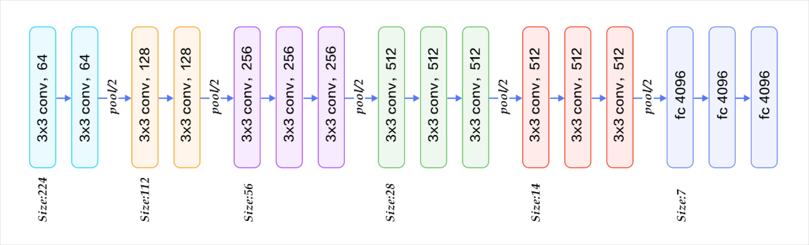

# VGG 전이학습을 통한 고양이·개 이미지 분류

 

이미지 분류(Image Classification)는 컴퓨터비전 분야에서 가장 기본적이면서도 중요한 문제다.  

특히 '개 vs 고양이 분류'는 대표적인 **이진 분류(binary classification)** 문제로, 많은 연구에서 벤치마크로 활용된다.  

하지만 딥러닝 모델을 처음부터 학습(Training from Scratch)하려면 대규모 데이터와 긴 학습시간이 필요하다.  

또한 데이터가 충분하지 않은 경우에는 <strong>과적합(overfitting)</strong>이 쉽게 발생하고, 학습된 모델의 일반화 성능도 떨어질 수 있다.  

 

이러한 한계를 해결하기 위한 방법으로 **전이학습(Transfer Learning)** 기법이 있다.  

전이학습은 대규모 데이터셋에서 미리 학습된 **신경망의 가중치**를 가져와,  

새로운 문제에 맞게 <strong>일부 레이어만 재학습(fine-tuning)</strong>한다.  

이를 통해 학습 시간을 크게 단축하고, 작은 데이터셋에서도 안정적인 성능을 낼 수 있다.  

이번 프로젝트에서는 VGG16 모델을 기반으로 전이학습을 수행한다.

 

### 📆 프로젝트 기간

&thinsp; **2024.09 ~ 2024.10**
 

### 📃목차 

 

## VGG16 (Visual Geometry Group 16-layer CNN)

VGG는 University of Oxford 내 Visual Geometry Group에서 개발한 합성곱 신경망(CNN)으로

모델명 자체가 특별한 원리를 담고 있지는 않고, 연구 그룹명을 따른 것이다.

**16은 학습가능한 가중치(Weight)를 가진 층의 수**를 의미하며

13개의 합성곱(Convolutional) 층과 3개의 전결합(Fully Connected) 층을 합쳐 총 16층으로 구성된다.

(아래 그림에서 max pooling과 softmax을 제외하면 16개의 층이 존재함)

 

### < VGG16 네트워크 아키텍처 >

