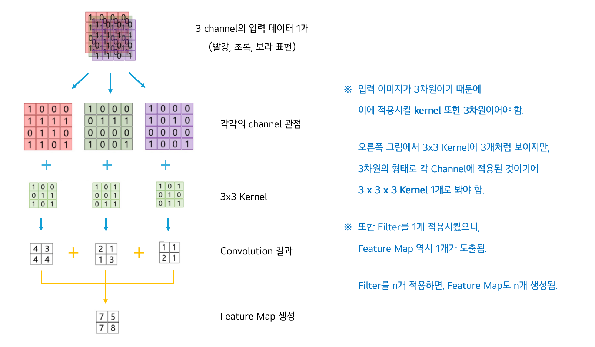
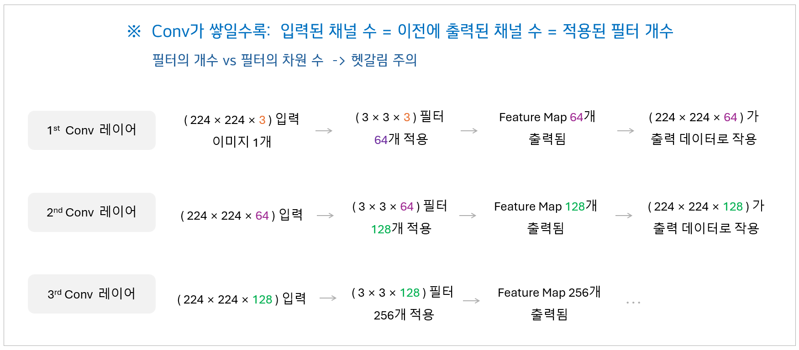

# VGG 전이학습을 통한 고양이·개 이미지 분류

 

VGG16은 ImageNet 대회(1000개 클래스, 1400만 장 이상의 이미지)에서 **범용 이미지 분류**를 위해 제안된 CNN 모델이다.

따라서 이미 대규모 데이터셋에서 학습된 가중치가 내장돼 있으며, 여기서 마지막 출력층(=분류기)만 교체하면

 새로운 분류 문제에도 재활용(fine-tuning)할 수 있다. ⇒ Cats vs Dogs **이진 분류**에 사용할 예정

 

### 📆 프로젝트 기간

&thinsp; **2024.09 ~ 2024.10**

 

### 📃목차 

&thinsp; • &thinsp;VGG의 의의

&thinsp; • &thinsp;VGG16 전이학습

&thinsp; • &thinsp;모델 성능 개선 (Dropout, Learning Rate, EarlyStopping 등)

&thinsp; • &thinsp;[부록] CNN이란

 

### 🔗소스코드 

&thinsp; [vgg_transfer.ipynb 바로가기](vgg_transfer.ipynb)

 

## 🔹VGG 16의 의의

▪ VGG(Visual Geometry Group)라는 모델명은 단순히 연구팀명을 따른 것으로, 특별한 원리를 담고 있진 않음

▪ 16이라는 숫자는 학습가능한 가중치(Weight)를 가진 층의 개수를 의미함

▪ 2014년에 대규모 이미지 분류 대회(ILSVRC)에 출전하여 준우승을 차지한 모델임

 

### ① 작은 filter를 깊게 쌓는 전략

▪ 기존의 CNN 모델은 7×7, 11×11 같은 큰 필터를 사용해 한 번에 넓은 영역을 보려고 했음

▪ 반면 VGG16은 **3×3 작은 필터**를 여러 번 연속으로(Depth ↑) 쌓는 방식을 도입함

▪ CNN의 수용 영역(Receptive Field) 관점에서, 7×7 Conv 한 번 == 3×3 Conv 세 번

▪ 하지만 3x3 필터는 **파라미터 수**가 더 적어, 7X7 필터보다 계산 효율이 증가함

> [!IMPORTANT]
> 작고 단순한 필터를 깊게 쌓는 것만으로도, 더 강력한 성능을 낼 수 있다는 것을 최초로 입증함   
> “딥러닝은 깊어야 성능이 좋다"라는 패러다임을 확립, 이후 ResNet(152층) / DenseNet 모델에 영향을 줌

 

### ② 규칙적인 네트워크 설계

▪ VGG16은 처음부터 끝까지 일관된 구조(**3×3 Conv + 2×2 MaxPooling**)를 반복적으로 쌓아 설계됨

▪ 층마다 구조가 제각각이었던 이전 모델(AlexNet 등)과 달리, 규칙성과 단순성이 유지됨

▪ 이로 인해 **모델 확장성**이 좋아져 연구자들이 baseline으로 쉽게 활용할 수 있음

 

### ③ 공간 축소 & 채널 확장 전략

▪ Conv 블록이 깊어질수록 Channel 수를 점진적으로 늘림 

▪ 공간 크기(해상도)는 Pooling을 적용해 절반씩 감소시켜 계산량을 줄임 

▪ 공간 정보는 줄어들지만 채널 수를 확장해 **정보량을 보존**하면서 추상화 수준을 높이는 효과를 달성

 

### < VGG16 아키텍처 >

아래 그림에서 max pooling과 softmax 층을 제외하면 총 16개의 층이 존재함

&thinsp;VGG16 네트워크의 구조 단계별 설명을 보고싶다면 클릭!

#### 1. 입력 (자동차 사진) [224 x 224 x 3]

− RGB 컬러 이미지를 입력으로 받음 (가로·세로 224px, 채널 3)

#### 2. 합성곱 층 (3×3 Conv + ReLU) [224 x 224 x 64]

− 224 × 224 : 여전히 공간 해상도는 그대로

− 64 : 원본 이미지가 64장의 feature map으로 변환됨 (3x3 Conv를 64개 적용시킴)

− 작은 3×3 필터를 여러 번 적용하면서 이미지 특징을 추출

#### 3. 풀링 층 (Max Pooling, 2×2 stride 2) [112 × 112 × 128]

− 풀링을 거쳐 가로/세로 크기가 절반으로 줄어듦 (224 → 112)

− 필터 개수는 128개로 증가시켜 더 많은 특징을 학습 (64 → 128)

− 공간 정보 압축해 모델이 더 복잡한 특징을 효율적으로 학습

#### 4. 깊어지는 합성곱 블록

− Conv 층 개수가 점점 많아지면서 (64 → 128 → 256 → 512) 더 추상적인 특징을 학습

− 동시에 Pooling은 계속하면서 이미지 크기를 절반씩 줄임 (56 → 28 → 14 → 7)

#### 5. 완전 연결층 (Fully Connected) [1 × 1 × 4096]

− Conv 결과를 일렬로 펼친 뒤 (Flatten) 4096 뉴런의 FC 레이어 2개를 거쳐서 고차원 특징을 통합

− 고차원 특징이라 함은 “이건 사람일 확률, 건물일 확률···” 같은 고차원 표현

#### 6. 출력층 (Softmax) [자동차 class로 최종 분류]

− 원래 VGG16은 ImageNet 기준으로 1000개 클래스(동물, 사물, 음식, 장소 등 다양한 범주)를 분류

− Softmax는 각 클래스별 확률 값을 계산하며, 그중 가장 높은 확률을 가진 클래스(자동차)로 최종 분류를 수행

---

 

## 🔹VGG16 전이학습 (Transfer Learning)

▪ 1000개의 클래스를 분류하던 VGG16의 **출력층**을, 2개의 클래스(개 vs 고양이)만 분류하게끔 **변형**시킴 

▪ 우선 Kaggle에서 제공하는 **Dogs vs Cats 데이터셋**을 다운받아야 함

▪ 훈련 / 검증 dataset 나눠서 전이학습을 위한 VGG16 파라미터를 재학습시킴 (끝부분만)

 

### < 개·고양이 Train / Validation 데이터셋 나누기 >

• 훈련 데이터: 8005장

• 검증 데이터: 2023장

• Kaggle에서 제공한 데이터셋 자체가 8:2 비율로 이미 나눠져있는 상태

 

### < VGG16 전이학습 >

• **include_top=False** : 원래 1000개 클래스를 분류하는 FC Layer (=출력부)는 제외

• **vgg_base.trainable = False** : Conv 레이어들은 훈련 중 업데이트되지 않음

• 개 vs 고양이 분류를 위한 출력층( **Dense(1, sigmoid)** ) 추가

• 중간에 Dense(256, relu)를 넣어 새로운 데이터셋에 맞는 학습으로 보완

> [!IMPORTANT]
> Cats vs Dogs 데이터셋을 토대로 새로운 출력층만을 학습하게 됨   
> Convolutional base는 그대로 두고, Fully Connected Layer만 업데이트함   
> 이 부분이 '전이시킨 모델'을 새로운 데이터로 fine-tuning 하는 과정

 

### < Training Process Output >

 

### < 훈련/검증 정확도 및 손실 변화 >

• 왼쪽 그래프: 훈련 및 검증 데이터의 정확도(Accuracy) 변화를 Epoch별로 비교한 것

• 훈련 정확도는 다소 불안정하게 변동하지만, **검증 정확도는 약 88~90% 수준**에서 안정적으로 유지됨

• 오른쪽 그래프: 훈련 및 검증 데이터의 손실(Loss) 변화를 Epoch별로 비교한 것

• **훈련 손실**은 다소 출렁거리는 모습을 보여 **과적합 가능성**을 시사함

 

## 🔹모델 성능 개선

▪ 위 결과 그래프를 보면, Training data에 대한 정확도와 손실이 오락가락하면서 불안정한 상태임

▪ 또한 Validation data와 차이가 큰 것으로 보아, 과적합 및 학습 불안정 예측됨

 

### < 개선된 모델: Dropout + 작은 학습률 + EarlyStopping 적용 >

• **Dropout(0.5)**: Dense layer 뉴런의 50%를 랜덤으로 OFF 시킨 후에 학습

• **learning_rate=1e-4**: 파라미터 업데이트를 천천히 진행시켜, 오버슈팅(accuracy 급등락) 줄임

• **EarlyStopping**: 불필요한 over-epoch 학습을 방지해 최적 성능 근처에서 자동 종료

 

### < Training Process Output >

 

### < 훈련/검증 정확도 및 손실 변화 >

• Train과 Validation 간의 차이가 적고, Validation 성능이 높아짐

• Dropout과 낮은 학습률 덕분에 Loss가 두 그래프 모두 안정적으로 수렴

• 과적합을 완화하고 **일반화 성능**을 개선하는 데 효과를 봄

 

## 🔹[부록] CNN이란?

▪ CNN (Convolutional Neural Network, 합성곱 신경망)

▪ 1980년대 일본의 후쿠시마 쿠니히코가 제안한 Neocognitron 구조가 시초

▪ 손글씨 숫자 인식 (MNIST 데이터셋) 문제에 CNN을 적용한 **LeNet-5** 모델이 발표되면서 널리 알려짐

▪ 이미지 분류, 객체 탐지, 영상 처리 등 컴퓨터비전 전반의 핵심 아키텍처

 

### ① 합성곱(Convolution)의 기본 원리

▪ CNN은 이미지의 **국소적인 특징**(local feature)을 잡아내기 위해 작은 크기의 <strong>필터(=Kernel)</strong>를   입력 이미지 위에서 슬라이딩하며 곱셈 및 덧셈 연산을 수행함 => 그 결과 feature map 도출

 

### ② 필터와 입력의 관계 (Channel 개념)

▪ 컬러 이미지는 보통 RGB 3채널(224×224×3) 형태임

▪ 따라서 필터도 입력 **이미지의 두께(=채널 수)에 맞춰서** 만들어져야 함

 

### ③ 출력과 채널 수 변화

▪ 입력 (224×224×3)에 Conv(3×3, 64 filters)를 적용한다고 치면, 출력은 (224×224×64)

▪ 이 출력된 feature map 64장은 곧 **다음 층의 입력**이 됨

▪ 따라서 다음 층은 **입력 채널 수가 64개**가 되고, 새로운 필터 집합(128개) 시 출력은 (224×224×128)이 됨

